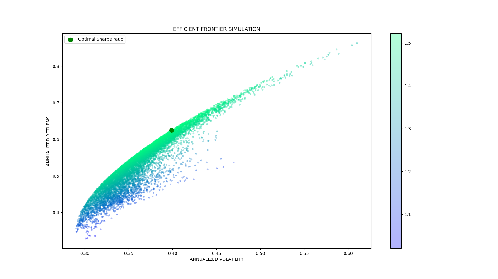

# QUANTATECH SECURITIES **PORTFOLIO GENERATOR**
### _OPTIMALIZE YOUR STOCK PORTFOLIO WITH EASE_


**Portfolio Generator** generates thousands of portfolios out of a set of user-specified assets in order to find the optimal portfolio considering risk and reward. 


1. Project Overview
2. Walkthrough Example of _AAPL, AMZN, NVDA, & TSLA_
3. Dependencies
4. Additional Information

## Project Overview

Once run, the model asks for an integer representing the number of assets you want in your portfolio. Once you have provided an integer, the model further asks you to specify which assets you want to include in your portfolio. It's important to notice that the model only accepts stocks, as a result, you need to enter ticker symbols for the stocks you want to include. Further, the model downloads financial data from yahoo and generates a predetermined set of ten-thousand portfolios. A visualization of the portfolios alongside the efficient frontier of the portfolios will automatically be displayed and dowloaded in your local directory. Additionally, the estimated weighting, risk, and return will be written into a generated .txt file in your local directory. 

## AAPL, AMZN, NVDA, & TSLA Walkthrough Example
In order to run the program type the following command 

```sh
python script.py
```

You will get prompted by an input message asking you to input an integer representing the number of assets you want to include in your portfolio. 

```sh
NUMBER OF ASSETS: 
```

Further, you will be prompted by a set of input messages where you will need to input the ticker symbols of your stock assets. The amount of input messages depends on your chosen number of assets.

```sh
Ticker 1: AAPL
Ticker 2: AMZN
Ticker 3: NVDA
Ticker 4: TSLA
```

Further, the model generates a predetermined amount of portfolios and calculates the optimal efficient frontier. The model saves the visualization of the efficient frontier alongside key data of the portfolio in a .txt file in your directory. 

[

```sh
PORTFOLIO OVERVIEW, <CURRENT DATE>
Annualized Return: 62.0% 
Annualized Volatility: 40.0% 
Symbols      AAPL  AMZN   NVDA   TSLA
Allocation  43.62  0.56  15.36  40.46
```

### Dependencies
The dependencies used in the project are listed below

| Dependency | Version|
| ------ | ------ |
| yfinance |0.1.63 |
| matplotlib | 3.4.3 |
| pandas| 1.3.3 |
| numpy|1.21.1 |
| datetime | 0.7.5 |
|pandas_datareader|0.10.0|

### Additional Information
If you have any questions about the project feel free to contact us over [ail](mailto:quantatech.securities@gmail.com)


